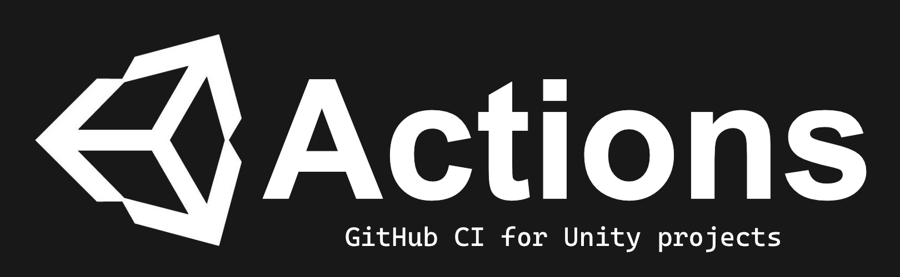
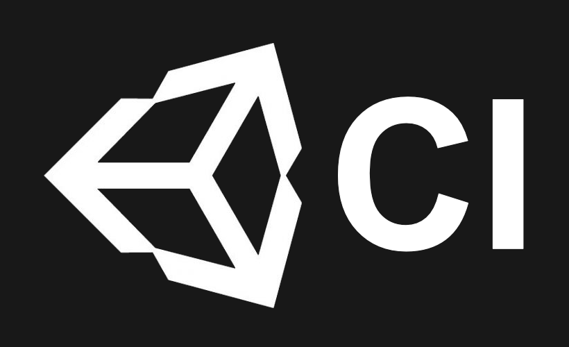

 
 

The fastest and **easiest** way to automatically test and build any Unity project!

Part of the  open source project.
 
 

 
 

#### Supported versions

Unity Actions are based on the 
[unity3d](https://gitlab.com/gableroux/unity3d) 
images from 
[GabLeRoux](https://github.com/GabLeRoux). 
Any version in this 
[list](https://hub.docker.com/r/gableroux/unity3d/tags)
can be used to test and build projects.

## Project Status

#### Checkout

| Description             | Done | Status |
|-------------------------|------|--------|
| [Checkout project](https://github.com/actions/checkout) | ✔ | Native support |

#### Configure

| Description             | Done | Status |
|-------------------------|------|--------|
| [Request activation file](https://github.com/marketplace/actions/unity-request-activation-file) | ✔ |  |
| [Activate license](https://github.com/marketplace/actions/unity-activate) | ✔ |  |
| [Return license](https://github.com/marketplace/actions/unity-return-license) | ✔ |  |
| [Caching dependencies](https://github.com/marketplace/actions/cache)  | ✔ | Native support |

#### Test

| Description             | Done | Status |
|-------------------------|------|--------|
| [Test edit mode](https://github.com/marketplace/actions/unity-test-runner) | ✔ |  |
| [Test play mode](https://github.com/marketplace/actions/unity-test-runner) | ✔ |  |
| [Test all in one](https://github.com/marketplace/actions/unity-test-runner) | ✔ |  |

#### Build

| Description             | Done | Status |
|-------------------------|------|--------|
| [Build for WebGL](https://github.com/marketplace/actions/unity-builder) | ✔ |  |
| [Build for Windows](https://github.com/marketplace/actions/unity-builder) | ✔ |  |
| [Build for Linux](https://github.com/marketplace/actions/unity-builder) | ✔ |  |
| [Build for MacOS](https://github.com/marketplace/actions/unity-builder) | ✔ |  |
| [Build for Android](https://github.com/marketplace/actions/unity-builder) | ✔ |  |
| [Build for iOS](https://github.com/marketplace/actions/unity-builder) | ✔ |  |
| [Build for Windows store](https://github.com/marketplace/actions/unity-builder) | ❌ | In progress |
| [Build for PS4](https://github.com/marketplace/actions/unity-builder) | ❌ | In progress |
| [Build for XboxOne](https://github.com/marketplace/actions/unity-builder) | ❌ | In progress |
| [Build for tvOS](https://github.com/marketplace/actions/unity-builder) | ❌ | In progress |
| [Build for Switch](https://github.com/marketplace/actions/unity-builder) | ❌ | In progress |

## How to use

Find the
[docs](https://unity-ci.com/docs/github)
on the Unity CI
[website](https://unity-ci.com/).

Have any questions or comments? Feel free to create an issue!

## Community

Feel free to join us on

and engage with the community.

## Contributions

To contribute please follow the contribution
[guide](./CONTRIBUTING.md)
to get set up quickly.

This repository and all related actions are open for your suggested changes!

Feel free to submit a pull request with the suggested changes.

## Licence 

This repository is [MIT](./LICENSE) licensed.

This includes all contributions from the community.
